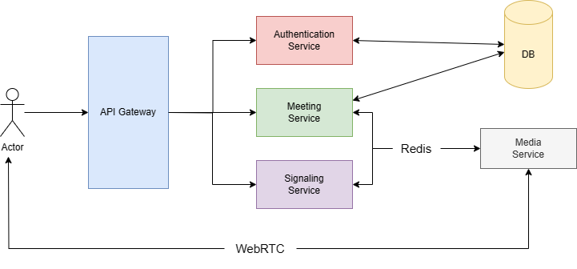

# High Level Design

We have divided the Whole Project in the following services:

- ## **Authentication Service**
    - Responsible for user authentication, authorization, and management.
    - Handles user registration, login, and access control.
    - Integrates with external identity providers (e.g., Google OAuth, LDAP) for authentication.
- ## **Meeting Service**
    - Core service for managing meetings, sessions, and collaboration features.
    - Provides APIs for creating, scheduling, joining, and managing meetings.
    - Handles meeting lifecycle, participant management, and access control.
    - Access control can be managed by generating JWT Tokens (with Permissions) that will be used for authentication during Initialization of Web Socket Connection.
- ## **Signaling Service**
    - Manages signaling protocols for establishing and managing real-time communication sessions.
    - Handles WebRTC signaling, peer-to-peer connections (Client and Server)
    - Implements WebSocket using Socket.IO for real-time communication with clients.
- ## **Media Service**
    - Manages media streams, audio/video processing, and real-time media handling.
    - Implements WebRTC media server functionalities for media processing and routing.
    - Supports media encoding, decoding, transcoding, and streaming optimizations.
    - Responsible for Server-Side Meeting Recording if required. (Optional)
- ## **Inter-Service Communication**
    - Redis will be used as a message broker for asynchronous communication.
    - Its Pub/Sub Functionality will not just support communication between the services but also helps to communicate between the instances of same service.
    - Supports event-driven architecture for handling real-time events.
    
    

#

  <a href="./Architecture.md">< Previous</a>
  <a href="../README.md" style="margin: 0 auto;">Home</a>
  <a href="./LLD.md">Next ></a>

    
